<div class="MCWHeader1">
SQL Server Hybrid Cloud
</div>

<div class="MCWHeader2">
Hands-on lab step-by-step
</div>

<div class="MCWHeader3">
March 2019
</div>


Information in this document, including URL and other Internet Web site references, is subject to change without notice. Unless otherwise noted, the example companies, organizations, products, domain names, e-mail addresses, logos, people, places, and events depicted herein are fictitious, and no association with any real company, organization, product, domain name, e-mail address, logo, person, place or event is intended or should be inferred. Complying with all applicable copyright laws is the responsibility of the user. Without limiting the rights under copyright, no part of this document may be reproduced, stored in or introduced into a retrieval system, or transmitted in any form or by any means (electronic, mechanical, photocopying, recording, or otherwise), or for any purpose, without the express written permission of Microsoft Corporation.

Microsoft may have patents, patent applications, trademarks, copyrights, or other intellectual property rights covering subject matter in this document. Except as expressly provided in any written license agreement from Microsoft, the furnishing of this document does not give you any license to these patents, trademarks, copyrights, or other intellectual property.

The names of manufacturers, products, or URLs are provided for informational purposes only and Microsoft makes no representations and warranties, either expressed, implied, or statutory, regarding these manufacturers or the use of the products with any Microsoft technologies. The inclusion of a manufacturer or product does not imply endorsement of Microsoft of the manufacturer or product. Links may be provided to third party sites. Such sites are not under the control of Microsoft and Microsoft is not responsible for the contents of any linked site or any link contained in a linked site, or any changes or updates to such sites. Microsoft is not responsible for webcasting or any other form of transmission received from any linked site. Microsoft is providing these links to you only as a convenience, and the inclusion of any link does not imply endorsement of Microsoft of the site or the products contained therein.
© 2018 Microsoft Corporation. All rights reserved.

Microsoft and the trademarks listed at https://www.microsoft.com/en-us/legal/intellectualproperty/Trademarks/Usage/General.aspx are trademarks of the Microsoft group of companies. All other trademarks are property of their respective owners.

**Contents**

<!-- TOC -->

- [SQL Server Hybrid Cloud hands-on lab step-by-step](#sql-server-hybrid-cloud-hands-on-lab-step-by-step)
  - [Abstract and learning objectives](#abstract-and-learning-objectives)
  - [Overview](#overview)
  - [Solution architecture](#solution-architecture)
  - [Requirements](#requirements)
    - [Help references](#help-references)
  - [Exercise 1: SQL Backup solution](#exercise-1-sql-backup-solution)
    - [Task 1: Create an Azure Storage Account](#task-1-create-an-azure-storage-account)
    - [Task 2: Configure managed backup in SQL Server](#task-2-configure-managed-backup-in-sql-server)
  - [Exercise 2: Implement a Data Archive Strategy with SQL Server Stretch Database](#exercise-2-implement-a-data-archive-strategy-with-sql-server-stretch-database)
    - [Task 1: Crete a logical SQL Server to host Stretch DB](#task-1-crete-a-logical-sql-server-to-host-stretch-db)
    - [Task 2: Identify tables that may benefit from Stretch DB](#task-2-identify-tables-that-may-benefit-from-stretch-db)
    - [Task 3: Implement Stretch DB based on date key](#task-3-implement-stretch-db-based-on-date-key)
  - [Summary](#summary)
  - [Exercise 3: Build SQL Availability Group for Database Disaster Recovery](#exercise-3-build-sql-availability-group-for-database-disaster-recovery)
    - [Task 1: Create the cluster](#task-1-create-the-cluster)
    - [Task 2: Create the SQL Server Availability Group](#task-2-create-the-sql-server-availability-group)
    - [Task 3: Create the Internal Load Balancer](#task-3-create-the-internal-load-balancer)
    - [Task 4: Validate the Availability Group](#task-4-validate-the-availability-group)
    - [Task 5: Update the Web Application to Connect to the Listener](#task-5-update-the-web-application-to-connect-to-the-listener)
    - [Summary](#summary-1)
  - [Exercise 4: Configure Azure Site Recovery for Web Tier DR](#exercise-4-configure-azure-site-recovery-for-web-tier-dr)
    - [Task 1: Create a Recovery Services Vault](#task-1-create-a-recovery-services-vault)
    - [Task 2: Configure Azure Site Recovery](#task-2-configure-azure-site-recovery)
    - [Task 3: Creating the Recovery Plan](#task-3-creating-the-recovery-plan)
  - [Exercise 5: Failing Over to the Disaster Recovery Site](#exercise-5-failing-over-to-the-disaster-recovery-site)
    - [Task 1: Failover the Data Tier](#task-1-failover-the-data-tier)
    - [Task 2: Failover the Web Tier](#task-2-failover-the-web-tier)
    - [Task 3: Validate Failover of the CloudShop application](#task-3-validate-failover-of-the-cloudshop-application)
  - [After the hands-on lab](#after-the-hands-on-lab)
    - [Task 1: Delete the resource groups created](#task-1-delete-the-resource-groups-created)

<!-- /TOC -->

# SQL Server Hybrid Cloud hands-on lab step-by-step 

## Abstract and learning objectives 

In this hands-on lab, you will build a disaster recovery site for an on-premises environment. You will enhance the existing database solution to support a hybrid cloud-based disaster recovery solution, implement an archiving strategy and a backup/restore strategy designed to protect data.

At the end of the lab, you will be better able to design and use availability sets, Managed Disks, SQL Server Always on Availability Groups, Stretch DB and SQL Server Managed Backup.

## Overview

Contoso has asked you to deploy their infrastructure in a resilient manner to insure their infrastructure will be available for their users and gain an SLA from Microsoft.

## Solution architecture

Cloud based disaster recovery site.

    need new diagram

## Requirements

1.  Microsoft Azure Subscription

2.  Virtual Machine Built during this hands-on lab or local machine with the following:

    - Visual Studio 2017 Community or Enterprise Edition
    - Latest Azure PowerShell cmdlets:
        - <https://azure.microsoft.com/en-us/downloads/>
        - <https://docs.microsoft.com/en-us/powershell/azure/install-azurerm-ps>
        - Ensure you reboot after installing the SDK or Azure PowerShell may not work correctly.

### Help references
|    |            |
|----------|:-------------:|
| **Description** | **Links** |
| Authoring ARM Templates | <https://azure.microsoft.com/en-us/documentation/articles/resource-group-authoring-templates/> |
| Virtual Machine Scale Set Samples | <https://github.com/gbowerman/azure-myriad> |
| Azure Quick Start Templates | <https://github.com/Azure/azure-quickstart-templates> |
| Network Security Groups | <https://azure.microsoft.com/en-us/documentation/articles/virtual-networks-nsg/> |
| Managed Disks | <https://azure.microsoft.com/en-us/services/managed-disks> |
| Always-On Availability Groups | <https://docs.microsoft.com/en-us/sql/database-engine/availability-groups/windows/overview-of-always-on-availability-groups-sql-server?view=sql-server-2017> |
| SQL Server Managed Backup to Azure | <https://docs.microsoft.com/en-us/sql/relational-databases/backup-restore/sql-server-managed-backup-to-microsoft-azure?view=sql-server-2017> |
| Virtual Network Peering | <https://docs.microsoft.com/en-us/azure/virtual-network/virtual-network-peering-overview> |
| Azure Backup |  <https://azure.microsoft.com/en-us/services/backup/> |


## Exercise 1: SQL Backup solution

Duration: 30 minutes

Backups must be maintained offsite from the on-premises environment. The backups must be online and accessible by the DBA team. To accomplish this you will configure SQL Managed Backup.

### Task 1: Create an Azure Storage Account

In this task, you will create an Azure Storage Account for use with SQL Managed Backup.

1.  Connect to your CloudShopSQL virtual machine by navigating to your **CloudShop1** resource group and then connecting to the **CloudShopSQL** virtual machine.

2.  Login with user name **demouser** and password **demo@pass123**.

3.  Launch **Server Manager**, select **Local Server** from the menu on the left and verify that **IE Enhanced Security Configuration** is set to **Off**.

    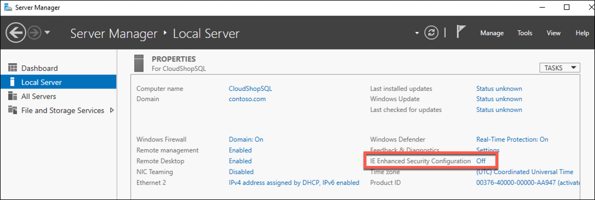

4.  From within your SQL Server guest virtual machine, install Azure PowerShell by launching an **administrative PowerShell ISE session** and running the following command. Accept any warnings or authorization to install the components.

    ```
    Install-Module -Name AzureRM -AllowClobber
    ```

5.  From the PowerShell ISE, type the following at the prompt and follow the prompts to login to your Azure subscription.

    ```
    login-AzureRmAccount
    ```

6.  Execute the following PowerShell commands in the PowerShell ISE to create a new storage account and generate the T-SQL needed to configure managed backup for the database. Before executing the script, change the **$storageAcctName** variable to a unique name and change the location to match the location you are deploying into for this lab.

    ```powershell
    $storageAcctName = "[unique storage account name]"

    $resourceGroupName = "CloudShop2"
    $containerName= "backups"
    $location = "[choose the same region you used to deploy the CloudShop2 resource group]"
    $storageSkuName = "Standard_LRS"

    "Creating Storage Account $storageAcctName"
    $sa = New-AzureRmStorageAccount -ResourceGroupName $resourceGroupName  `
        -Name $storageAcctName `
        -Location $location `
        -SkuName $storageSkuName 

    $storageKey = (Get-AzureRmStorageAccountKey -Name $storageAcctName -ResourceGroupName $resourceGroupName )[0].Value
    $context = New-AzureStorageContext -StorageAccountName $storageAcctName -StorageAccountKey $storageKey

    Write-Host "Creating New Storage Container  $containerName" 
    New-AzureStorageContainer -name $containerName -permission container -context $context

    $fullSasToken = New-AzureStorageContainerSASToken -Name $containerName -Permission rwdl -FullUri -Context $context  
    $containerUrl = $fullSasToken.Substring(0,$fullSasToken.IndexOf("?"))
    $sasToken = $fullSasToken.Substring($fullSasToken.IndexOf("?")+1)

    $enableManagedBackupScript = @"
    --------------------
    ---BEGIN TSQL Script
    --------------------
    CREATE CREDENTIAL [$containerUrl] 
    WITH IDENTITY = 'Shared Access Signature', 
         SECRET = '$sasToken' 

    GO

    EXEC msdb.managed_backup.sp_backup_config_basic   
     @enable_backup = 1,   
     @database_name = 'AdventureWorks',  
     @container_url = '$containerUrl',   
     @retention_days = 30
       
     --------------------
     ---END TSQL Script
     --------------------
    "@

    Write-Host $enableManagedBackupScript 
    ```

7.  Execute the code using PowerShell ISE. Make sure you change the **\$storageAcctName = \"\[unique storage account name\]\"** field to a unique storage account name across Azure prior to execution. 

    >**Note**: Due to differences between markdown and PowerShell formatting requirements, you may need to remove the white space prior to the **\"\@** near the end of the file.

8.  Save the T-SQL code generated between the **Begin TSQL Script** and **End TSQL Script** in your PowerShell ISE output after execution into a notepad file. This code creates an identity using a Shared Access Signature (SAS) to a container in the storage account and configures managed backup when executed.

### Task 2: Configure managed backup in SQL Server

1.  From within your SQL Server virtual machine, launch SQL Server Management Studio and connect to the local database instance.

2.  From within SQL Server Management Studio, click **New Query**.

    

3.  Refresh SQL Server Management Studio and if SQL Server Agent is stopped right click on it and click Start.

    

4. Paste in the following code and click **Execute** to enable SQL Server Agent extended stored procedures. 

    ```sql
    EXEC sp_configure 'show advanced options', 1
    GO
    RECONFIGURE
    GO
    EXEC sp_configure 'Agent XPs', 1
    GO
    RECONFIGURE
    GO
    ```

5.  Paste the T-SQL code you copied at the end of the previous task into the query window replacing the existing code and click **Execute**. This code creates the new SQL identity with a Shared Access Signature for your storage account. 

6.  Paste the code below into the query window replacing the existing code and click **Execute** to create a custom backup schedule.

    ```sql
    USE msdb;  
    GO  
    EXEC managed_backup.sp_backup_config_schedule   
         @database_name =  'AdventureWorks'  
        ,@scheduling_option = 'Custom'  
        ,@full_backup_freq_type = 'Weekly'  
        ,@days_of_week = 'Monday'  
        ,@backup_begin_time =  '17:30'  
        ,@backup_duration = '02:00'  
        ,@log_backup_freq = '00:05'  
    GO
    ```
7.  Execute the following tSQL in the query window to generate a backup on-demand. You can also specify Log for \@type.

    ```sql
    EXEC msdb.managed_backup.sp_backup_on_demand   
    @database_name  = 'AdventureWorks',
    @type ='Database'
    ```

8. To verify that your backups are working, go to the Azure portal, navigate to your **CloudShop2** resource group. Open the storage account you just created, select the **Blobs** tile, then the **backups** container. You should see your backups here.

## Exercise 2: Implement a Data Archive Strategy with SQL Server Stretch Database

Duration: 30 minutes

In this exercise, you will implement SQL Server Stretch Database to stretch data from a table into Azure.

### Task 1: Crete a logical SQL Server to host Stretch DB 

1.  From your **CloudShopSQL** virtual machine, launch a browser, navigate to the Azure portal and login with your Azure credentials.

2.  Click **+Create a resource** at the top of the left side menu.

3.  Type **SQL Server logical server** into the search box, hit enter and choose **SQL server (logical server)** from the search results.
    

4. Click **Create** on the SQL Server (logical server) information blade.
5. On the SQL Server (logical server) blade, use the following configurations and click **Create**.

    - Server name: ***Choose a unique server name***
    - Server admin login: **demouser**
    - Password: **demo@pass123**
    - Subscription: ***Your subscription***
    - Resource group: **CloudShop2**
    - Location: ***Use the same location you used for CloudShop2***
    - Allow Azure Services: ***Checked***

        

6. Make note of the server name you chose above. It will be used in a later task.

7. After the SQL Server logical server has deployed, navigate to it and select **Firewalls and virtual networks** from the security menu on the left.

    

8. Add a new firewall rule by clicking **+Add client IP** and then clicking **Save**.

    

### Task 2: Identify tables that may benefit from Stretch DB 

1.  From your **CloudShopSQL** virtual machine, launch SQL Server Management Studio if it is not already open.

2.  In the SQL Server Management Studio Object Explorer, connect to your local SQL Server instance and expand the Databases folder.

3.  Right-click the AdventureWorks database, select Tasks, select Stretch, then choose Enable.

    

4.  The Enable Database for Stretch wizard should open automatically. Click **Next** on the Introduction screen.

5.  On the Select tables window all of your tables will be listed. Notice that some tables have warnings and some may be greyed out. Click on the warning icon next to one of the tables. This indicates that the table does not meet the StretchDB eligibility requirements.

    

6.  Scroll to the right until you see the Migrate column. Clicking Entire Table on an eligible table allows you to define which rows will be migrated to Azure. In this lab, we are going to configure Stretch Database through TSQL. Click Cancel to break out of the wizard.

### Task 3: Implement Stretch DB based on date key  

1.  Launch a new Query tab and execute the following code to prepare the server and the database for Stretch Database. 

    ```
    --Enable the server for Stretch Database
    EXEC sp_configure 'remote data archive' , '1';
    GO
    RECONFIGURE;
    GO

    --Create a database master key to encrypt the data stored in Azure
    USE [AdventureWorks]
    GO
    CREATE MASTER KEY ENCRYPTION BY PASSWORD='demo@pass123'
    GO

    --Create the credential used to access an Azure SQL Database
    CREATE DATABASE SCOPED CREDENTIAL StretchDB 
    WITH IDENTITY = 'demouser' , SECRET = 'demo@pass123'
    GO
    ```

2.  Execute the following code replacing the server name with the name of the SQL Server you created in exercise 1. This code enables Stretch Database on your database. It may take a few minutes to complete.

    ```
    --Enable the local database for stretch
    --You must change your server name to match your environment
    ALTER DATABASE [AdventureWorks]
    SET REMOTE_DATA_ARCHIVE = ON (SERVER = N'<your server name>.database.windows.net', CREDENTIAL = StretchDB )
    ```

3.  Execute the following code to create the stretch predicate. The stretch predicate allows us to define the conditions under which a row will be stretched. In this case the function leverages a date key column to stretch any rows prior to January 1, 2002. 

    ```
    --Create the stretch predicate
    CREATE FUNCTION dbo.fn_stretch_datekey_predicate(@column1 int)
    RETURNS TABLE
    WITH SCHEMABINDING 
    AS 
    RETURN	SELECT 1 AS is_eligible
		    WHERE @column1 < '20020101'
    GO
    ```

4. Execute the following to begin the migration of eligible data to your Azure SQL Database.

    ```
    --Enable stretch on the table using the stretch predicate with the OrderDateKey
    ALTER TABLE Sales.ResellerSales 
    SET ( REMOTE_DATA_ARCHIVE = ON (
	    FILTER_PREDICATE = dbo.fn_stretch_datekey_predicate([OrderDateKey]),
	    MIGRATION_STATE = OUTBOUND
    ) )
    ```

5. Refresh the AdventureWorks database in Object Explorer by right clicking it and choosing Refresh.

6. Right-click the AdventureWorks database, choose Tasks, Stretch, then select Monitor

7. View the stretch database report. Note that over time the Eligible Rows, Local Rows, and Rows In Azure numbers will change as data is migrated to your Stretch Database in Azure.

    

8.	Click the dropdown under Migration State. Notice that you have the option to pause the outbound migration.

9.	Launch a new Query tab and execute the following code to programatically monitor space used in Azure and locally.

    ```
    sp_spaceused 'Sales.ResellerSales', @mode = 'REMOTE_ONLY'
    GO
    sp_spaceused 'Sales.ResellerSales', @mode = 'LOCAL_ONLY'
    GO
    ```
10. You may also change the scope of a query.

    ```
    SELECT COUNT(*) FROM [Sales].[ResellerSales] WITH (REMOTE_DATA_ARCHIVE_OVERRIDE = REMOTE_ONLY)
    ```

## Summary
In this exercise, you implemented an archive solution with Stretch Database. First, you reviewed the table compatibility by using the Enable Database for Stretch wizard. You then configured your database and table via T-SQL to archive data satisfied by a stretch predicate. Finally, you reviewed the progress, status and space used locally and in Azure via the built-in management tools

## Exercise 3: Build SQL Availability Group for Database Disaster Recovery

Duration: 60 minutes

In this exercise, you will build a SQL Always-On Cluster for resiliency of the data tier.

### Task 1: Create the cluster

In this task, you will create the underlying Windows Failover Cluster which is the base of your SQL Server Availability Group. You will begin by logging in with an account with administrative privileges on all of the prospective nodes of the cluster, and running a Failover Cluster Validation test. This test verifies that all of the nodes of your cluster are properly configured to support clustering and will flag any best practices that you may not be adhering to in your configuration. Finally, you will create the cluster across the three nodes of you cluster.

1.  Launch a browser and navigate to <https://portal.azure.com>. Login 
    with your Azure credentials if you haven't already.

    > Note: You may need to launch an \"in-private\" session in your
browser if you have multiple Microsoft Accounts.

2.  Navigate to your **CloudShop1** resource group and open your **CloudShopSQL** virtual machine and connect to it via Remote Desktop.

3.  Login with the **CONTOSO\demouser** domain account with password **demo@pass123**. Note that this is NOT the same account that you have been using, this is a domain account.

4.  Launch Server Manager if it does not start automatically. 

5.  Select **Local Server** from the menu on the left and scroll down to **Roles and Features**, click the **Tasks** dropdown and select **Add Roles and Features** from the list.

    

6.  On the **Before you begin** page, click **Next**.

7.  On the **Select installation type** page, select **Role-based or feature-based installation** and click **Next**.

8.  On the **Select destination server** page, select the current server and click **Next**.

9.  On the **Select server roles** page, accept the defaults and click **Next**.

10. On the **Select features** page, select **Failover Clustering**, then click **Add Features** on the popup and then click **Next**.

    

11. On the **Confirm installation selections** page, click **Install**.

12. Repeat the above steps to install Failover Clustering on your remaining SQL Servers (CloudShopSQL2 and CloudShopSQL3).

13. From CloudShopSQL, open **Administrative Tools** and then launch **Failover Cluster Manager**.

14. From the Actions pane on the right, choose **Validate Configuration**.

    

15. Click **Next** on the Before You Begin window.

16. On the Select Servers or a Cluster window, enter **CloudShopSQL** and then click the **Add** button. Repeat for **CloudShopSQL2** and **CloudShopSQL3** then click **Next**.

    

16. On the Testing Options window, select the **Run only tests I select** radio button and click **Next**

    

17. On the Test selection window, uncheck storage. The storage tests have no relevance for our case and will only throw additional warnings.

    

18. On the Confirmation window, click **Next** to begin the validation tests.

19. Review the output of the tests by clicking the **View Report** button. This validation test aids you in determining if your server and network configuration is correctly configured for Windows Failover Clustering. You should review any warnings or errors. In our case, the environment was preconfigured to support clustering so there should be no errors. There may be warnings regarding best practices such as multiple network cards etc. In a production environment these warnings must be taken seriously as they may adversely effect the performance and reliability of the cluster. In our lab they will have a negligible impact.

20. Click **Finish** on the Validate a Configuration Wizard.

21. On CloudShopSQL, open the PowerShell ISE and execute the following code:

    ```
    New-Cluster -Name CLUST01 -Node CloudShopSQL, CloudShopSQL2, CloudShopSQl3 -StaticAddress 10.0.1.7, 172.16.1.7  -NoStorage
    ```
    > **Note**: This command requires that you are logged in with an account that is an administrator on all nodes specified. For this lab you should use **CONTOSO\demouser**.

    This will create a three node cluster with two static IP addresses. We need two static IP addresses because the cluster may be running from our on-premises environment (CloudShop1) or our cloud disaster recovery environment (CloudShop2).  
    
    It is also possible to use a wizard for this task but the resulting cluster will require additional configuration to set the static IP addresses to be viable in Azure. This is due to the manner in which Azure distributes IP addresses causing the cluster to receive the same IP address as the node it is executing on resulting in a duplicate IP address and failure of the cluster service.

22. Open the Failover Cluster Manager on CloudShopSQL from the start menu under Winows Administrative Tools. In the right navigation right-click **Failover Cluster Manager** and click **Connect to Cluster**. Click OK in the pop-up. Expand the **CLUST01** cluster, select **Nodes**, validate that all nodes are online and that Assigned Vote and Current Vote are 1 for all nodes of the cluster.

    

### Task 2: Create the SQL Server Availability Group

1.  On CloudShopSQL, launch **SQL Server 2017 Configuration Manager**.

2.  Select **SQL Server Services**, then right-click **SQL Server
    (MSSQLSERVER)** and select **Properties**.

    

3.  Click on the **Log On** tab. To setup a SQL Server Availability
    Group, the SQL Server service account needs to have access to all of
    the SQL Servers that will participate in the Availability Group.
    Change the service account to the **CONTOSO\\demouser** domain
    account using **demo@pass123** for the password.

    

4.  Select the **AlwaysOn High Availability** tab and check the box for
    **Enable AlwaysOn Availability Groups**, then click **OK**, then
    click **Yes** to confirm the account change.

    

5.  Restart the SQL Server service by right-clicking the service and choosing **Restart**.

    

6.  Repeat this configuration for **CloudShopSQL2** and **CloudShopSQL3**.

7.  The database you will be replicating has its data and log files in the
    C:\\Data folder and the C:\\Log folder on CloudShopSQL. We need to verify that the same folder
    structure exists on our secondary servers, CloudShopSQL2 and CloudShopSQL3. Login to **CloudShopSQL2** and **CloudShopSQL3**
    and verify that these folders exist. If they do not exist, create them.

8.  Open a remote desktop connection to the CloudShopSQL virtual machine and
    login using the **CONTOSO\\demouser** account. Note that this
    demouser account is the domain administrator account. You must type
    the domain name in, otherwise you will be logged in with the local
    administrator account.

9.   Your SQL Server Availability Group will require a file share to be
    used for the initial synchronization. Open up File Explorer and
    create a new folder in the root of the C: drive called **AG**.

10. Right-click the new folder and select **Share with \> Specific
    people...**
    
    

11. On the File Sharing window, select **Administrators** and click
    **Share**, then click **Done**.

12. Launch **SQL Server Management Studio** and connect to
    **CloudShopSQL**.

13. Expand the databases folder, right-click the **AdventureWorks** database and select **Properties**.

14. On the Database Properties window, select **Options** then set the recovery model to **Full** and click the **OK** button. The full recovery model is required for databases that participate in SQL Server Always On Availability Groups.

    

15. Right-click the **AdventureWorks** database, select **Tasks** and choose **Back Up...**.

    

16. On the Back Up Database - AdventureWorks window, choose to backup to disk, click **Add**, and set the destination to **C:\\Data\\AdventureWorks.bak**, then click **OK** and click **OK** again to initiate the backup.

    

17. From the SQL Server Management Studio CloudShopSQL connection, right-click **AlwaysOn High Availability** then select **New Availability Group Wizard...**
    
    

18. Click **Next** on the Introduction screen.

19. Specify **AdventureWorks** for the name of the availability group
    and click **Next**.

    

20. Double-click the password field next to the **AdventureWorks** database and enter the password **demo@pass123** and click **Refresh**. The status of the
    database should state that it \"Meets prerequisites\" meaning that the database is in Full recovery mode and that you have supplied the correct password for the database master key. Click **Next**.

    

21. On the Specify Replicas tab, click the **Add Replica...** button and connect
    to CloudShopSQL2 and CloudShopSQL3.

    

22. Click on the **Listener** tab, select the **Create an availability
    group listener** radio button, set the following values for the
    listener, then click **Add**.

    - Listener DNS Name: **AdventureWorks**

    - Port: **1433**

    - Network Mode: **Static IP**

        

23. You will need to add two IP addresses for the listener, for the first use **10.0.1.8** and for the other use 172.16.1.8, then click
    **Next**.

    

24. Ensure that **Full database and log backup** is selected and use **\\\\CloudShopSQL\\ag** for
    the network share. Click **Next** to continue.

    

25. The validation tests will run automatically. They should all show
    success. Click **Next**.

    

26. Verify your configuration then click **Finish** to build the
    Availability Group. Click **Close** after the wizard completes.

### Task 3: Create the Internal Load Balancer

1.  In the Azure Portal, navigate to the **CloudShop2** resource group
    and click **Add**.

2.  Type **Load Balancer** into the search bar then choose the **Load
    Balancer** and click the **Review + Create** button, then click **Create**.

    

3.  On the Create load balancer blade, configure the following options,
    then click **Create**:

    - Subscription: ***Your subscription***
    - Resource group: **CloudShop2**
    - Name: **sqlag**
    - Region: ***Choose the region you have used for this lab***
    - Type: **Internal**
    - SKU: **Basic**
    - Virtual network: **VNET2**
    - Subnet: **Data**
    - IP address assignment: **Static**
    - Private IP address: **172.16.1.8**

        

4.  Navigate back to your resource group and select the **sqlag** load
    balancer you just created.

5.  On the sqlag load balancer blade, select **Backend pools**, then
    click the **+Add** button.

    

6.  On the Add backend pool blade, use the following configurations:

    - Name: **sqlpool**
    - IP version: **IPv4** 
    - Associated to: **Availability set**
    - Availability set: **SQLAvSet2**

        

7.  Click the **+ Add a target network IP configuration** button.

    

8.  Select **CloudShopSQL2** for the Target virtual machine, and select
    **ipconfig1 (172.16.1.5)** for the Network IP configuration.

    

9.  Repeat steps 7-8 to add **CloudShopSQL3**. DO NOT ADD other machines to
    the backend pool. Click **OK** then wait for the load balancer to
    complete the update.

10. On the sqlag load balancer blade, select **Health Probes** and
    click the **+Add** button.

11. On the Add health probe blade, use the following configuration
    values then click **OK** and wait for the load balancer to complete
    the update.

    - Name: **sqlprobe** 
    - Protocol: **TCP** 
    - Port: **59999** 
    - Interval: **5** 
    - Unhealthy threshold: **2** 

        

12. On the sqlag load balancer blade, select **Load balancing rules**
    and then click the **+Add** button.

13. On the Add load balancing rule blade, use the following
    configuration values then click **OK** and wait for the load
    balancer to complete the update.

    - Name: **sqlrules**
    - IP Version: **IPv4**
    - Frontend IP address: **172.16.1.8 (LoadBalancerFrontEnd)**
    - Protocol: **TCP**
    - Port: **1433**
    - Backend port: **1433**
    - Backend pool: **sqlpool**
    - Probe: **sqlprobe**
    - Session persistence: **None**
    - Idle timeout: **4**
    - Floating IP: **Enabled**

        

14. Open an Administrative PowerShell ISE session on **CloudShopSQL2**.

15. Copy the following PowerShell script to the script window and
    execute it to configure your cluster for the probe port.

    ```
    $ClusterNetworkName = "Cluster Network 2" 

    $IPResourceName = "AdventureWorks_172.16.1.8" 

    $ILBIP = "172.16.1.8" 

    Import-Module FailoverClusters

    Get-ClusterResource $IPResourceName | Set-ClusterParameter -Multiple @{"Address"="$ILBIP";"ProbePort"="59999";"SubnetMask"="255.255.255.255";"Network"="$ClusterNetworkName";"EnableDhcp"=0}

    Stop-ClusterResource -Name "AdventureWorks_172.16.1.8"
    Stop-ClusterResource -Name "AdventureWorks"
    Start-ClusterResource -Name "AdventureWorks"
    ```

### Task 4: Validate the Availability Group 

1.  Login to your CloudShopSQL virtual machine and launch SQL Server Management Studio. 

2.  From Object Explorer, launch a new connection and connect to the **adventureworks** listener. This is simply to check if your listener is actually working. 

3.  From your CloudShopSQL connection, expand Always On High Availability, Availability Replicas, then righ-click **CloudShopSQL2** and choose **Properties**.

    

4.  On the properties window, change the availability mode to **Synchronous commit** and then click **OK**. 

    Switching to synchronous commit allows us to failover without data loss. If we leave it in asynchronous mode, the failover would be "forced" which also implies some loss of data and invalidates the old primary replica. Since we are only testing functionality of our listener we DO NOT want to break the Availability Group replication.  

    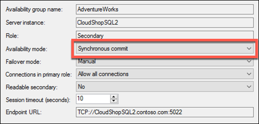

5.  Repeat the above for **CloudShopSQL**. This will enable synchronous commits between the two replicas allowing us to failover without breaking the Availability Group replication.

6.  Right-click the **AdventureWorks** Availability Group, and choose **Show Dashboard** from the menu.

    

7.  The dashboard should show both **CloudShopSQL** and **CloudShopSQL2** with a status of **Synchronized**.

    

8.  Right-click the **AdventureWorks** Availability Group again and choose **Failover...** from the menu.

    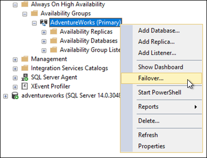

9.  In the Failover Wizard, click **Next** on the first screen.

10. On the Select New Primary Replica window, select **CloudShopSQL2** and then click **Next**.

    

11. On the Connect to Replica window, connect to **CloudShopSQL2** with the **CONTOSO\demouser** account and click **Next**.

    

12. On the summary window, click **Finish**, then click **Close** on successful completion of the failover.

13. Connect to your **AdventureWorks** listener and open a new Query Window.

14. Run the following code to verify that you are running from CloudShopSQL2.

    ```
    SELECT @@SERVERNAME
    ```

    

15. Use the Failover Wizard to fail **AdventureWorks** back to CloudShopSQL. 

### Task 5: Update the Web Application to Connect to the Listener 

1.  Login to your CloudShopWeb virtual machine.

2.  Launch File Explorer and navigate to **C:\inetpub\wwwroot**.

3.  Open the **web.config** file in Notepad. 

4.  Edit the connection string to connect to the **AdventureWorks** listener.

    

5.  Save the file.

6.  Launch a command prompt and execute **iisreset**. 


### Summary

In this exercise, you deployed a Windows Failover Cluster and a SQL Always-On Availability Group for database resiliency. Also you deployed and configured an internal load balancer to support the Availability Group in Azure. Finally, you validated your configuration by failing over to one of your secondary nodes and connecting to the Availability Group Listener.

## Exercise 4: Configure Azure Site Recovery for Web Tier DR 

Duration: 15 minutes

In this exercise, you will configure Azure Site Recovery to protect your web application and allow it to fail to your disaster recovery site.

### Task 1: Create a Recovery Services Vault

1. From the Azure portal, select **+Create a resource** from the menu on the left.

2. In the search box, type **Backup and site recovery** and then select **Backup and site recovery (OMS)** from the results.

3. Click the **Create** button on the information blade.

4. On the Recovery Services vault creation blade, use the following configurations and click **Create**.

    - Name: **RSVault**
    - Subscription: *Choose your subscription*
    - Resource group: **CloudShop2**
    - Location: ***Use the same location assigned to CloudShop2***

        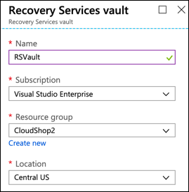

### Task 2: Configure Azure Site Recovery

1. In the Azure Portal navigate to the Recovery Services vault you just created.
   
2. Select **Site recovery infrastructure** from the menu on the left and then choose **Network mapping**.

3. Click the **+Add mapping** button. Set your source network to VNET1 and your target network to VNET2.

    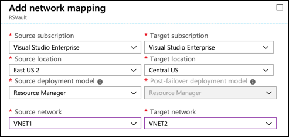

4. In the Recovery Services vault blade, click on **Site Recovery** under **Getting started**.

    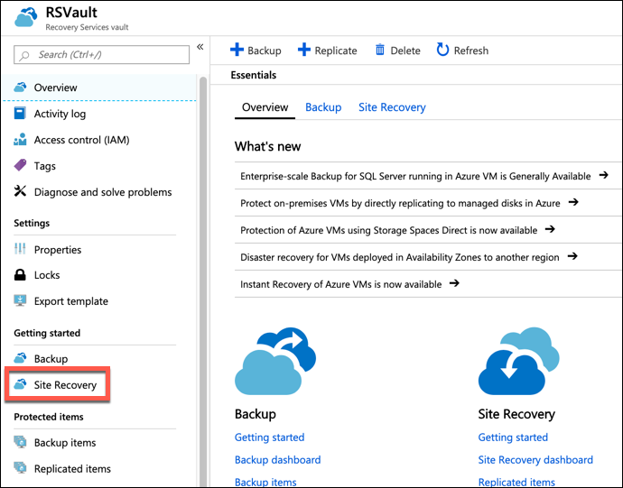

5. Under **FOR ON-PREMISES MACHINES AND AZURE VMS** click **Step 1: Replicate Application**.

    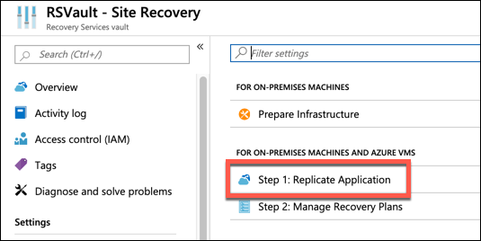

6. Choose the following configurations and click **OK**.

    - Source: **Azure**
    - Source location: ***The location of your CloudShop1 resource group***
    - Azure virtual machine deployment model: **Resource Manager**
    - Source subscription: *Your subscription*
    - Source resource group: **CloudShop1**

        

7. On the select virtual machines blade, select the **CloudShopWeb** virtual machine for replication. We will only use Azure Site Recovery to protect the web servers. Click the **OK** button.

    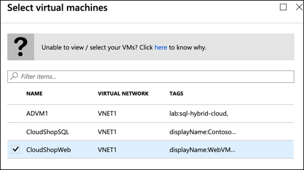

8. On the Configure settings blade, set the Target location to the location of your CloudShop2 resource group. 

9. Click on the **Customize** link.

    

10. Change the target resource group to **CloudShop2**.

    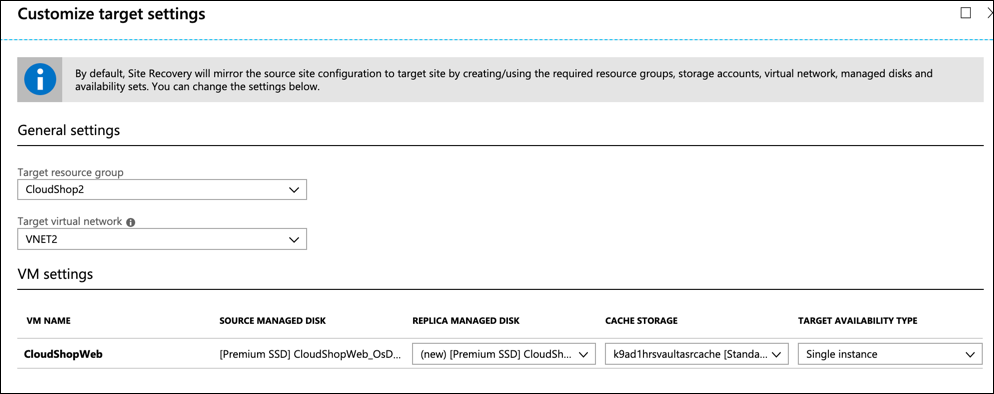

11. Click **Create target resources**. 

    **Note**: Do not close the blade. It will close by itself after the target resources are created (2-3 minutes).

    

12. On the Enable Replication blade, click the **enable replication** button. 

13. Several Site Recovery jobs will be initiated which are creating the replication policy as well as the target resources to be used during a failover. Click on **Site recovery jobs** to view the job progress.

    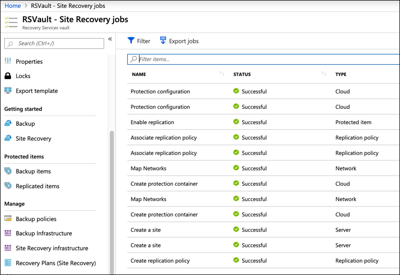

14. Once all the jobs are successful, click on **Replicated items** under **Protected Items** to view the status of the initial replication.
    
    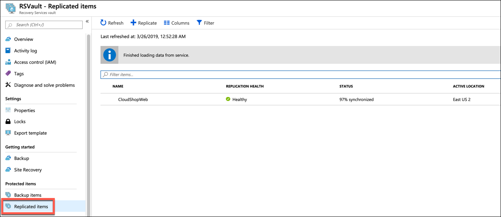

15. While waiting for the initial replication/synchronization, move on to the next task.

### Task 3: Creating the Recovery Plan

In this task, you will create the recovery plan that will be used to orchestrate failover action for the web tier.

1. Within the properties of the Recovery Services vault, click on **Recovery Plans (Site Recovery)** under Manage.

    

2. Click the **+Recovery Plan** button.

3. On the Create recovery plan blade enter the name **CloudShopRP**. In the Source area select the region where your CloudShop1 resource group is deployed. The Target will be automatically selected. Under Allow items with deployment model, select **Resource Manager**. Click Select items and select the Virtual Machine. Click **OK** and then click **OK** on the Create recovery plan blade.

    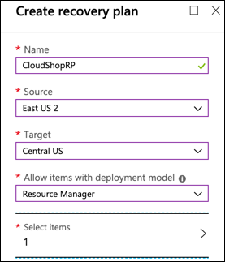

4. After a minute or two, you should see the CloudShopRP on the Recovery plans blade. This recovery plan will bring up your web server during a failover. 
   
5. Now go back to the Recovery Services vault RSVault - Overview blade. Click on Site Recovery. Notice that the CloudShopWeb virtual machine is replicating. Take note of the status. It should be close to 100%. You will not be able to continue until it is finished replicating. 
   
   **Note**: This may take up to an hour.

    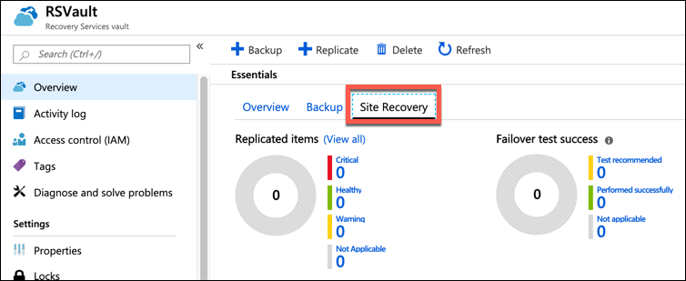

## Exercise 5: Failing Over to the Disaster Recovery Site 

Duration: 30 minutes

In this exercise, you will fail over to your disaster recovery site.

### Task 1: Failover the Data Tier

1.  Login to your CloudShopSQL virtual machine and launch SQL Server Management Studio. 

2.  Open a connection to your CloudShopSQL instance, expand Always On High Availability, Availability Replicas, then righ-click **CloudShopSQL2** and choose **Properties**.

    

3.  On the properties window, change the availability mode to **Synchronous commit** and then click **OK**. Note that in a real outage scenario it may not be possible to use this method and may require a forced failover which may incur some data loss.  

    

4.  Repeat the above for **CloudShopSQL**. This will enable synchronous commits between the two replicas allowing us to failover without breaking the Availability Group replication.

5.  Right-click the **AdventureWorks** Availability Group and choose **Failover...** from the menu.

    

6.  In the Failover Wizard, click **Next** on the first screen.

7.  On the Select New Primary Replica window, select **CloudShopSQL2** and then click **Next**.

    

8.  On the Connect to Replica window, connect to **CloudShopSQL2** with the **CONTOSO\demouser** account and click **Next**.

    

9.  On the summary window, click **Finish**, then click **Close** on successful completion of the failover.

### Task 2: Failover the Web Tier

To fail over the entire environment requires the database server to be up, then the web server may come online. After successfully failing over the data tier in the previous step we will now failover the web tier via ASR. 

1. From the Azure portal, navigate to your **RSvault** resource.

2. Select **Recovery Plans (Site Recovery)** from the menu on the left.

    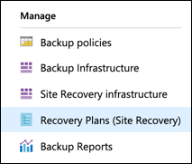

3. Select your **CloudShopRP** recovery plan.

4. On the CloudShopRP recovery plan blade, click the **...More** button, and then select **Failover** from the dropdown menu.

    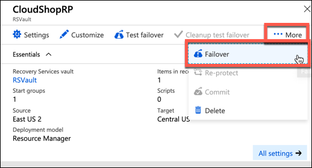

5. Check the box next to **I understand the risk**.

6. Verify your failover settings and click **OK**.

    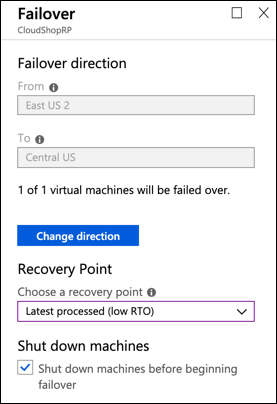

7. You can monitor the status of your failover by selecting **Site recovery jobs** from the monitoring section of the menu on the left.

8. After the failover completes, navigate to the **CloudShop2** resource group and open your **CloudShopWeb** virtual machine. 

9.  Notice that it does not have a Public IP address. Click on **Networking** on the menu to the left.

    

10. Select the **CloudShopWebNetworkInterface**.

    

11. Select **IP Configurations** from the menu.

    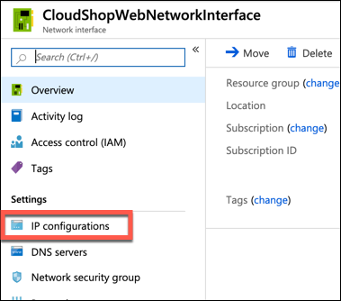

12. Change the **Public IP address settings** to **Enabled**, then create a new public IP address called **webpubip**. Click **OK** and **Save**.

    

13. Open a command prompt and issue an **iisreset** to restart the web service.

### Task 3: Validate Failover of the CloudShop application 

1. From the Azure portal, navigate to the **CloudShopWeb** virtual machine.   

2. Copy the **Public IP address** and paste it into a browser to verify that your site is working.

## After the hands-on lab

### Task 1: Delete the resource groups created

1.  Within the Azure portal, click Resource Groups on the left navigation.

2.  Delete each of the resource groups created in this lab by clicking them followed by clicking the Delete Resource Group button. You will need to confirm the name of the resource group to delete.

You should follow all steps provided *after* attending the hands-on lab.

