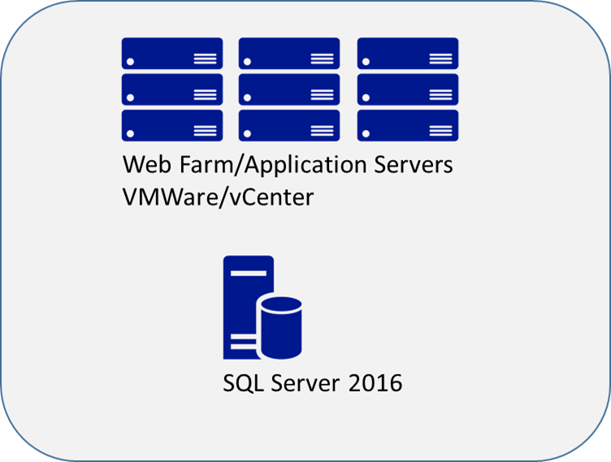

SQL Server hybrid cloud

Whiteboard design session student guide

December 2018

Information in this document, including URL and other Internet Web site references, is subject to change without notice. Unless otherwise noted, the example companies, organizations, products, domain names, e-mail addresses, logos, people, places, and events depicted herein are fictitious, and no association with any real company, organization, product, domain name, e-mail address, logo, person, place or event is intended or should be inferred. Complying with all applicable copyright laws is the responsibility of the user. Without limiting the rights under copyright, no part of this document may be reproduced, stored in or introduced into a retrieval system, or transmitted in any form or by any means (electronic, mechanical, photocopying, recording, or otherwise), or for any purpose, without the express written permission of Microsoft Corporation.

Microsoft may have patents, patent applications, trademarks, copyrights, or other intellectual property rights covering subject matter in this document. Except as expressly provided in any written license agreement from Microsoft, the furnishing of this document does not give you any license to these patents, trademarks, copyrights, or other intellectual property.

The names of manufacturers, products, or URLs are provided for informational purposes only and Microsoft makes no representations and warranties, either expressed, implied, or statutory, regarding these manufacturers or the use of the products with any Microsoft technologies. The inclusion of a manufacturer or product does not imply endorsement of Microsoft of the manufacturer or product. Links may be provided to third party sites. Such sites are not under the control of Microsoft and Microsoft is not responsible for the contents of any linked site or any link contained in a linked site, or any changes or updates to such sites. Microsoft is not responsible for webcasting or any other form of transmission received from any linked site. Microsoft is providing these links to you only as a convenience, and the inclusion of any link does not imply endorsement of Microsoft of the site or the products contained therein.

© 2018 Microsoft Corporation. All rights reserved.

Microsoft and the trademarks listed at <https://www.microsoft.com/en-us/legal/intellectualproperty/Trademarks/Usage/General.aspx> are trademarks of the Microsoft group of companies. All other trademarks are property of their respective owners.

**Contents** 

<!-- TOC -->

- [SQL Server hybrid cloud whiteboard design session student guide](#sql-server-hybrid-cloud-whiteboard-design-session-student-guide)
  - [Abstract and learning objectives](#abstract-and-learning-objectives)
  - [Step 1: Review the customer case study](#step-1-review-the-customer-case-study)
    - [Customer situation](#customer-situation)
    - [Customer needs](#customer-needs)
    - [Customer objections](#customer-objections)
    - [Infographic for common scenarios](#infographic-for-common-scenarios)
    - [Azure Site Recovery](#azure-site-recovery)
    - [Azure Traffic Manager](#azure-traffic-manager)
    - [SQL Server Always Encrypted](#sql-server-always-encrypted)
    - [SQL Server Stretch Database](#sql-server-stretch-database)
  - [Step 2: Design a proof of concept solution](#step-2-design-a-proof-of-concept-solution)
  - [Step 3: Present the solution](#step-3-present-the-solution)
  - [Wrap-up](#wrap-up)
  - [Additional references](#additional-references)

<!-- /TOC -->

#  SQL Server hybrid cloud whiteboard design session student guide

## Abstract and learning objectives 

In this whiteboard design session, you will look at how to design an application for hybrid deployment between on-premises and Microsoft Azure. You will consider how the web tier must be made available in the event of an outage as well as how to configure SQL Server Always-on Availability Groups to deploy and failover between both locations.

At the end of this whiteboard design session, you will be better able to design a hybrid disaster recovery solution between an on-premises VMWare environment and Azure. In addition, you will design a SQL Server scale-out solution, protect database backups from local failures, archive cold data from an on-premises SQL Server, and perform end-to-end encryption on sensitive application data.

## Step 1: Review the customer case study 

**Outcome**

Analyze your customer's needs.

Timeframe: 15 minutes

Directions:  With all participants in the session, the facilitator/SME presents an overview of the customer case study along with technical tips.

1.  Meet your table participants and trainer.

2.  Read all of the directions for steps 1-3 in the student guide.

3.  As a table team, review the following customer case study.

### Customer situation

Fabrikam Publishing is a media and publishing company in Seattle, Washington with approximately 5000 employees. They have a successful direct-to-consumer e-commerce site built with .NET, and they use SQL Server to store customer profile and order information.
Fabrikam has a single data center for both internal and customer-facing applications. Most servers are virtualized on VMware. Application servers primarily run Microsoft server software, including Active Directory (AD) Domain Services and a number of AD-integrated services including Exchange 2013 as well as multi-tier, internal, and AD-integrated Microsoft Internet Information Services (IIS) based web applications with SQL Server 2017 as the database platform.

Recently, the site experienced a multi-day outage due to a lightning strike that disabled both the primary and secondary cooling systems at the data center. In order to avoid such long outages in the future, Fabrikam is investing in a secondary site for disaster recovery. "A disaster recovery site has been on our project proposals for the last four years, but it has always been shelved due to budget constraints," says Michelle Jenkins, Chief Information Officer (CIO). "The recent outage combined with the new capabilities in the cloud have finally encouraged the board to approve the additional budget necessary to build out our disaster recover (DR) capabilities." To keep capital expenditures in check, Fabrikam would like to use the public cloud to host its DR site.

James Sherburn, Director of Information Technology Operations, describes Fabrikam's current disaster recovery strategy as a classic backup/restore strategy with no offsite warm standby machines. Backups are dumped on a network share, and these backups are then archived once per day to an offsite location. There is no enterprise backup solution in place. According to Sherburn, this strategy requires an "all hands-on deck" approach to recovering the site, which is resource-intensive and slow. It also requires significant expense to bring temporary hardware online at a remote, vendor-provided data center. Because of the cost and complexity, this disaster recovery plan has never been tested, and Information Technology (IT) is not confident that it could bring up the secondary site in a reasonable amount of time. This lack of confidence in the current DR strategy prevented IT management from implementing a failover during the last disaster, resulting in significant losses for the company.

The application team is concerned that the database DR solution will have a negative impact on the overall database performance. The website currently experiences periodic database latency issues during peak load. They would like to have a solution that improves performance of the predominantly read workloads generated by the website to improve the overall responsiveness and the user experience. The Database Architect, Brandon Burns, saw a presentation at a conference last year on leveraging SQL Server Availability Groups with readable secondaries to offload read workloads. Brandon said, "Our ideal solution would be a scale out solution for the data platform, however, we are concerned about potentially making a lot of application code changes." We need a solution that minimizes the amount of changes in the application, and we would like to investigate SQL Server Availability Groups and readable secondaries.

The database administration team is worried about future Payment Card Industry (PCI) compliance issues related to data that is currently stored in varchar fields in the database. In the current system, the database is inaccessible from outside the application except through a dedicated administrative jump-box. Implementing a DR site means that we will be transferring data, and they want to make sure that PCI data being transferred is encrypted. They are concerned about cloud security and the implications it may have to their annual PCI audits. To mitigate any perceived risk and shortcut any issues that may be raised in the PCI audit, they would like to encrypt ALL of the PCI data at both the application and database level.

Future application plans call for new applications that will need to access the encrypted PCI/PII data stored in the database. Key management should be handled by the Fabrikam Security Administration team. They will be responsible for protecting and managing the keys. They need a solution that enables them to accomplish this goal across the multiple applications that will potentially leverage the encrypted database without revealing unencrypted production keys to DBAs or developers.

An additional concern is that the database maintenance jobs are exceeding the current maintenance window. Robert Moore, Manager of Database Administration, believes this is due to the lack of an archive strategy on the current order related tables. Backup times have gradually increased over time to the point where they exceed the maintenance window. Moore's other concern is the sheer size of these databases could make initial synchronization or resynchronization of the DR site a long process that could result in the site running in an exposed state for extended periods. Currently, the database holds approximately 10 years' worth of data. "Data older than one year is rarely accessed," says Moore. The business has resisted any data archiving because of several reports that periodically need access to the historical data.

Finally, Fabrikam has a requirement to store the database backups offsite in an encrypted format within two hours of backup completion and they need insight into when backups are not occurring across all databases in the environment, they currently rely on manual configuration of SQL Agent jobs to run backups and management is concerned that not all databases are being backed up appropriately. The current backup strategy consists of SQL Server backups to an on-premises file server; the backups are then copied to tape and shipped offsite. This process can take up to 24 hours to secure the tapes offsite. In addition to being slow, the tape backups are notoriously unreliable and are generally not available for ad hoc access in the case that a restore becomes necessary. Fabrikam would like to have these backups secured offsite within two hours of the backup completing and a centralized backup management and monitoring solution.

### Customer needs 

1.  A full multi-site disaster recovery solution with minimal complexity, orchestrated failover, and near-zero data loss.

2.  Highly available, fault-tolerant SQL Server service with cross-site disaster recovery and minimal impact on database performance.

3.  Scale-out the data platform utilizing SQL Server Availability Groups with readable secondaries to offload the heavy read workloads from the primary replica with minimal changes to the application.

4.  The ability to seamlessly scale DR site infrastructure as the environment grows.

5.  Data encryption solution that encrypts only PCI data at the application and database level.

6.  Key management solution that does not expose the unencrypted keys to unauthorized personnel (including database administrators and developers) and allows for key management by the security administration team.

7.  Data archiving to keep database sizes more manageable and reduce the amount of time needed for database maintenance.

8.  Centralized management and monitoring of backups with secure offsite backups.

### Customer objections 

1.  Solution must support orchestrated failover so that failover does not require an all hands-on deck.

2.  Solution must support the existing VMware infrastructure.

3.  Solution must not have a significant impact on database performance.

4.  DR infrastructure must be easily scalable to support changes in the workload.

5.  The disaster recovery sites must be highly available after a failover.

6.  We have seen some documentation surrounding the use of Availability Zones in Azure. What does Availability Zones provide over and above Availability Sets? Would this be a good option for us?

7.  Archive solution must not impact the current applications that periodically pull historical data from the production system.

8.  We need to be able to backup databases both on-premises and in the cloud. How will your backup solution support this?

### Infographic for common scenarios

### Azure Site Recovery

![This is a screenshot of a slide. Common scenarios for Azure Site Recovery include the following bulleted list items: ??? Support for on-premises to on-premises, and on-premises to Azure failover ??? Automated protection and replication of on-premises, Hyper-V, and VMware machines ??? Orchestrated failover ??? Customizable recovery plans ??? Recovery plan testing To the right of the list is a diagram of the multiple deployment architectures of Azure Site Recover: on-premises datacenter to Azure, and on-premises datacenter to on-premises datacenter. At this time, we are unable to capture all of the information in the diagram. Future versions of this course should address this.](images/Whiteboarddesignsessiontrainerguide-SQLServerhybridcloudimages/media/image3.png "Common Azure Site Recovery scenarios")

### Azure Traffic Manager

### SQL Server Always Encrypted

![On the Trusted side (left), an Apps icon has bidirectional arrows pointing to and from an Enhanced ADO.NET Library icon. At the bottom-left corner is a Column Master Key icon. On the SQL Server side (right), the bidirectional arrows continue and point to and from a database icon. Below this icon is a table with the following columns: Name (dbo.Patients), SSN (ciphertext), and Country. The values in the first row are as follows: Jane Doe, 1x7fg65se2e, and USA. The values in the second row are as follows: Jim Gray, 0x7ff65ae6d, and USA. The values in the third row are as follows: John Smith, 0y8fj75ea2c, and USA. At the bottom-right corner is a Column Encryption Key icon.](images/Whiteboarddesignsessiontrainerguide-SQLServerhybridcloudimages/media/image5.jpeg "SQL Server Always Encrypted diagram")

### SQL Server Stretch Database

![Stretch Database is a feature of SQL Server 2016. On the bottom-left side (on premises) are icons for a Local database (numbered 1) and a User Application (numbered 3 and represented as a monitor). In the Local database icon are tables representing Eligible Data (green) and Local Data (orange). On the top-right side (Azure) is an icon of an Azure SQL database (numbered 2 and labeled Remote Endpoint), and inside this icon is a table representing Remote Data. Two bidirectional arrows (the green one labeled Eligible Data and the orange one labeled T-SQL Queries) point across both sides to and from the local database icon and the Azure SQL database icon. One orange bidirectional arrow labeled T-SQL Queries point to and from the Local database icon and the User Application icon. Below the diagram is the following numbered list: 1. Local database: on-premises instance 2. Remote endpoint: Azure SQL Database holding remote copy 3. Application accessing data](images/Whiteboarddesignsessiontrainerguide-SQLServerhybridcloudimages/media/image6.png "SQL Server Stretch Database diagram")

## Step 2: Design a proof of concept solution

**Outcome**

Design a solution and prepare to present the solution to the target customer audience in a 15-minute chalk-talk format.

Timeframe: 60 minutes

**Business needs**

Directions: With all participants at your table, answer the following questions and list the answers on a flip chart:

1.  Who should you present this solution to? Who is your target customer audience? Who are the decision makers?

2.  What customer business needs do you need to address with your solution?

**Design**

Directions: With all participants at your table, respond to the following questions on a flip chart:

***Plan for high availability and disaster recovery***

1. **Orchestrated failover**: Fabrikam needs to automate and simplify the failover process for the web site. Design a solution that supports orchestrated failover of the entire site.

2. **Additional infrastructure:** Address what additional infrastructure Fabrikam needs to enable the stated solution.

3. **SQL Server:** The DR solution for SQL Server should include near-zero data loss. Design the DR solution to provide near-zero data loss, but minimal overhead on normal transactions. The solution should not require the application to be recoded.

4. **Availability:** The site should be highly available at the primary site. Explain which services would be used, and how your design meets these goals after failover.

***Scale out data platform***

1. **Database scale out:** The solution should include the ability to scale out the data platform for heavy read workloads without major code changes to the existing application.

2. **User experience**: Address the user experience issues of the data tier. How will this solution address this?

3. **Application impact**: What impact will your design have on the existing application?

4. **Diagram the solution**.

***Protect data***

1. **Encrypt PCI data:** Choose an appropriate encryption technology to protect credit card related data.

2. **Key management**: How are the encryption keys to be managed in your design?

3. **Application impact**: What impact will your design have on the existing application?

4. **Encryption type**: The following table shows some common types of PCI data. Determine the appropriate type of encryption for each data element to complete the table.

    |         |            |
    | ------------- |:-------------:|
    | **Data Element** | **Encryption Type** |
    | Primary Account Number (PAN)    |   |
    | Cardholder Name    |   |
    | Service Code    |   |
    | Expiration Date    |   |

5. **Diagram the solution**.

***Data archiving***

1. **Plan**: What questions would you pose to the customer in designing a data archive strategy?

2. **Identify archive data**: Describe how you would identify the appropriate tables for archiving.

3. **Determine impact**: What impact will your design have on the existing reporting system? How will this solution effect the current maintenance issues?

4. **Diagram the solution**.

***Offsite backup***

1. **Describe database backups:** What backup technologies would you consider? How does the solution meet the offsite requirements? How does this design meet the stated security goals?

2. **Provide the following configuration details:** What configuration will be required for this backup solution to support both cloud and on-premises SQL Servers?

**Prepare**

Directions: With all participants at your table:

1.  Identify any customer needs that are not addressed with the proposed solution.

2.  Identify the benefits of your solution.

3.  Determine how you will respond to the customer's objections.

Prepare a 15-minute chalk-talk style presentation to the customer.

## Step 3: Present the solution

**Outcome**

Present a solution to the target customer audience in a 15-minute chalk-talk format.

Timeframe: 30 minutes

**Presentation**

Directions:

1.  Pair with another table.

2.  One table is the Microsoft team and the other table is the customer.

3.  The Microsoft team presents their proposed solution to the customer.

4.  The customer makes one of the objections from the list of objections.

5.  The Microsoft team responds to the objection.

6.  The customer team gives feedback to the Microsoft team.

7.  Tables switch roles and repeat Steps 2-6.

##  Wrap-up 

Timeframe: 15 minutes

Directions: Tables reconvene with the larger group to hear the facilitator/SME share the preferred solution for the case study.

##  Additional references

|         |            |
| ------------- |:-------------:|
| **Description** | **Links** |
| Azure Site Recovery    | <https://docs.microsoft.com/en-us/azure/site-recovery/site-recovery-overview>  |
| Replicate VMware virtual machines and physical servers to Azure with Azure Site Recovery    | <https://docs.microsoft.com/en-us/azure/site-recovery/site-recovery-vmware-to-azure>  |
| Protect SQL Server with SQL Server disaster recovery and Azure Site Recovery         | <https://docs.microsoft.com/en-us/azure/site-recovery/site-recovery-sql> |
| High availability and disaster recovery for SQL Server in Azure Virtual Machines |  <https://docs.microsoft.com/en-us/azure/virtual-machines/windows/sql/virtual-machines-windows-sql-high-availability-dr>   |  |
| Configure an ILB listener for AlwaysOn Availability Groups in Azure   | <https://docs.microsoft.com/en-us/azure/virtual-machines/windows/sqlclassic/virtual-machines-windows-classic-ps-sql-int-listener> |
| PCI DSS Quick Reference Guide   | <https://www.pcisecuritystandards.org/documents/PCIDSS_QRGv3_2.pdf>   |
| Always Encrypted  | <https://docs.microsoft.com/en-us/sql/relational-databases/security/encryption/always-encrypted-database-engine>  |
| Azure Key Vault | <https://docs.microsoft.com/en-us/azure/key-vault>  |
| SQL Server Stretch Database  | <https://docs.microsoft.com/en-us/sql/sql-server/stretch-database/stretch-database>  |
| Azure Backup   | <https://docs.microsoft.com/en-us/azure/backup/>   |
| Azure Traffic Manager  | <https://docs.microsoft.com/en-us/azure/traffic-manager/traffic-manager-overview>   |
| Reduce RTO with Traffic Manager and Azure Site Recovery  | <https://docs.microsoft.com/en-us/azure/traffic-manager/traffic-manager-overview>  |
